# 📺 YT-RAG Bot: Semantic Video Intelligence

> **Production-ready, containerized RAG pipeline and FastAPI service turning any YouTube video into an interactive, timestamp-grounded knowledge engine.**


---

## 📸 Demo Preview

```text
======================================================================
   📺 YOUTUBE TRANSCRIPT RAG - SMART CHAT (CLI & REST API)
======================================================================
Target Video: What's The Most Expensive Thing Ever?
Target ID:    jXwOcpkMQAA

You >> What is the most expensive substance mentioned and how is it made?
Assistant:
OVERVIEW: Antimatter is presented as the most expensive substance in existence.

TECHNICAL HIGHLIGHTS:
- A single gram releases energy equivalent to three Hiroshima nuclear bombs.
- Production requires particle acceleration: firing particles into metal rods under vacuum.

TIMESTAMPS:
- [07:37] - Introduction to antimatter and energy potential.
- [08:10] - Physical production challenges and particle acceleration.
```

---

## 🎯 Problem Statement
- **Long-form Video Inefficiency**: Searching for specific concepts inside 1-3 hour lectures, podcasts, and documentaries requires tedious manual scrubbing.
- **Scraper Fragility**: Standard transcript scraping APIs frequently fail due to rate limits or dynamic bot blocks.
- **LLM Hallucinations**: Generic LLMs invent facts when asked about specific long-form video details without context grounding.

---

## 💡 Solution Overview
**YT-RAG Bot** automates transcript extraction with a triple-redundant ingestion pipeline (`yt-dlp` → `youtube-transcript-api` → local fallback), injects fine-grained `[MM:SS]` timestamps, and builds persistent video-isolated FAISS vector databases. It exposes both an **interactive CLI** and a **FastAPI REST API** with full Docker support.

---

## 📈 Business & Engineering Impact
- ⚡ **95% Time Saved**: Retrieve timestamped answers from hour-long videos in sub-seconds.
- 🛡️ **Near-100% Ingestion Reliability**: Fallback hierarchy eliminates single points of failure in video data acquisition.
- 💰 **Zero-Redundancy Compute**: Vector indices are persisted locally; previously ingested videos cost $0 in repeat embedding tokens.
- 🔌 **Decoupled Architecture**: REST backend is ready to power Streamlit, Gradio, React, Chrome extensions, or Slack/Discord bots.

---

## 🚀 Key Features
- 🛡️ **Triple-Redundancy Ingestion Engine**: Automatic failover between `yt-dlp`, standard scraper, and local fallback files.
- ⏱️ **Temporal Timestamp Citations**: Embeds `[MM:SS]` markers throughout the vector space for verifiable video citations.
- 🔍 **Vector Index Isolation**: Separate FAISS storage per video ID prevents cross-contamination of knowledge bases.
- 🌐 **Production FastAPI REST API**: Comprehensive OpenAPI/Swagger endpoints for info, ingestion, search, and chat.
- 🐳 **Full Dockerization**: One-command deployment with Docker and Docker Compose with persistent volume mounts.

---

## 🏗 System Architecture

```mermaid
graph LR
    A["🎬 YouTube URL / ID"] --> B["⚙️ Triple Ingestion\n(yt-dlp / Scraper / Fallback)"]
    B --> C["✂️ Recursive Splitter\n(Chunk=1000, Overlap=200)"]
    C --> D["🧠 OpenAI Embeddings\n(text-embedding-3-small)"]
    D --> E[("🗄️ FAISS Vector Store\n(Persisted by Video ID)")]

    F["👤 User Query"] --> G["🔍 Similarity Search (k=4)"]
    E --> G
    G --> H["📝 Prompt with [MM:SS] Context"]
    H --> I["🤖 OpenAI Chat Model\n(gpt-4o-mini / gpt-4o)"]
    I --> J["✅ Timestamped Structured Response"]

    classDef source fill:#3b1f4a,stroke:#c678dd,color:#f0e6ff
    classDef process fill:#1a3340,stroke:#56b6c2,color:#e0f4f8
    classDef storage fill:#1a2540,stroke:#61afef,color:#ddeeff
    classDef rag fill:#2a2010,stroke:#e5c07b,color:#fff5cc
    classDef output fill:#102a1a,stroke:#98c379,color:#d4f5d4

    class A,F source
    class B,C process
    class D,E storage
    class G,H,I rag
    class J output
```



---

## 🛠 Tech Stack

| Layer | Technology | Purpose |
| :--- | :--- | :--- |
| **Backend API** | [FastAPI](https://fastapi.tiangolo.com/) + [Uvicorn](https://www.uvicorn.org/) | High-performance asynchronous REST API |
| **Orchestration** | [LangChain](https://www.langchain.com/) (LCEL) | Declarative RAG chaining and prompt templates |
| **LLM & Embeddings** | [OpenAI API](https://openai.com/) | `gpt-4o-mini` & `text-embedding-3-small` (1536 dims) |
| **Vector DB** | [FAISS](https://github.com/facebookresearch/faiss) | In-memory similarity search with local disk serialization |
| **Ingestion** | `yt-dlp` + `youtube-transcript-api` | Robust automated caption & subtitle extraction |
| **Container** | [Docker](https://www.docker.com/) + Docker Compose | Containerized reproducible execution |

---

## 🔄 Runtime Workflow

1. **Request Received**: User provides YouTube URL or Video ID via CLI or REST API.
2. **Metadata Resolution**: Fast oEmbed lookup extracts clean video title and checks local index cache.
3. **Ingestion & Indexing**: Subtitles are fetched with `yt-dlp`, split into timestamped segments, and vectorized via FAISS.
4. **Context Retrieval**: Query undergoes similarity search against the video-specific FAISS index.
5. **Grounded Generation**: OpenAI model synthesizes answer strictly using retrieved context with temporal citations.

---

## 📁 Project Structure

```text
YT-RAG_BOT/
├── app/                      # FastAPI Service Layer
│   ├── api/
│   │   └── routes.py         # REST Endpoints (/health, /info, /ingest, /chat, /search, /indexes)
│   ├── models/
│   │   └── schemas.py        # Pydantic Request/Response Models
│   ├── services/
│   │   └── rag_service.py    # Business Logic Decoupling Layer
│   └── main.py               # FastAPI App Entrypoint & Middleware
├── config.py                 # Central Configuration & OpenAI Factories
├── ingestion.py              # Triple-Redundancy ETL Pipeline
├── rag_chain.py              # LCEL RAG Prompt & Pipeline Assembly
├── utils.py                  # Regex Extractors & oEmbed Helpers
├── main.py                   # Interactive Terminal CLI
├── debug_openai.py           # OpenAI API Diagnostic Script
├── debug_youtube.py          # YouTube Scraper Diagnostic Script
├── test_api.py               # Automated FastAPI Integration Test Suite
├── test_check.py             # Quick End-to-End Verification
├── Dockerfile                # Production Container Definition
├── docker-compose.yml        # Multi-service Container Orchestration
├── requirements.txt          # Pinned Python Dependencies
└── .env.example              # Environment Variable Template
```

---

## ⚡ Quick Start

### 1. Clone & Configure
```bash
git clone https://github.com/SwayamAg/YT-RAG-Bot-Semantic-Video-Intelligence.git
cd YT-RAG-Bot-Semantic-Video-Intelligence
cp .env.example .env
```

Add your OpenAI key to `.env`:
```env
OPENAI_API_KEY=sk-...
OPENAI_MODEL=gpt-4o-mini
OPENAI_EMBEDDING_MODEL=text-embedding-3-small
```

---

### 2. Option A: Run via Docker (Recommended)
```bash
docker compose up --build
```
- Interactive Swagger Documentation: **`http://localhost:8000/docs`**
- Healthcheck Endpoint: **`http://localhost:8000/health`**

---

### 3. Option B: Run Locally

```bash
# Setup virtual environment
python -m venv .venv
.\.venv\Scripts\activate      # Windows (or source .venv/bin/activate on Linux/Mac)
pip install -r requirements.txt

# Run FastAPI Server
uvicorn app.main:app --reload --port 8000

# OR Run Interactive CLI
python main.py
```

---

## 🌐 REST API Reference

| Method | Endpoint | Description |
| :--- | :--- | :--- |
| `GET` | `/health` | Service health and active model configuration status |
| `POST` | `/api/v1/video/info` | Inspect video ID, title, and disk cache status |
| `POST` | `/api/v1/ingest` | Ingest and vectorize a video transcript into FAISS |
| `POST` | `/api/v1/chat` | Primary RAG Q&A generating timestamp-grounded answers |
| `POST` | `/api/v1/search` | Raw semantic similarity search returning top-K chunks |
| `GET` | `/api/v1/indexes` | List all persisted video vector indices |
| `DELETE` | `/api/v1/indexes/{video_id}` | Purge a cached vector index from disk |

---

## 💬 Verified Example Input & Output

**Video**: *[What's The Most Expensive Thing Ever? (jXwOcpkMQAA)](https://www.youtube.com/watch?v=jXwOcpkMQAA)*

### Sample Q&A Test Performed on System:

#### Question:
> *"What is the most expensive substance mentioned, its energy release, and how is it produced?"*

#### Output:
```text
OVERVIEW:
Antimatter is discussed as the most expensive substance in existence.

CORE WORKFLOW / KEY CONCEPTS:
- A single gram of antimatter releases energy equivalent to three Hiroshima nuclear bombs upon annihilation.
- Production requires particle acceleration by firing particles at high speeds into a metal rod and capturing resulting debris.

TECHNICAL HIGHLIGHTS:
- Antimatter production requires extreme vacuum conditions and particle acceleration techniques.
- CERN has generated less than 10 billionths of a gram throughout its entire operational history.

TIMESTAMPS:
- [07:37] Introduction to antimatter and energy potential.
- [07:51] Antimatter annihilation energy comparison.
- [08:10] Antimatter production mechanics and particle acceleration challenges.
```

---

## 🔒 Security & Limitations
- **Secret Management**: API keys are strictly read from environment variables; `.env` is ignored by `.gitignore` and `.dockerignore`.
- **Deserialization Security**: FAISS deserialization is constrained to locally generated directory structures.
- **Language Scope**: Multi-language caption parsing natively handles English (`en.*`) and Hindi (`hi.*`) with automatic caption fallback.

---

## 🔮 Future Improvements
- [ ] **Streaming Chat Responses**: Add Server-Sent Events (SSE) / WebSockets for token streaming in the API.
- [ ] **Streamlit / Gradio Web UI**: Build a frontend consuming the FastAPI endpoints.
- [ ] **Multi-Video Collections**: Enable querying across entire playlists or YouTube channels simultaneously.

---

## 👨‍💻 Author

- **Name**: Swayam Agarwal  
- **LinkedIn**: [linkedin.com/in/swayam-agarwal](https://www.linkedin.com/in/swayam-agarwal/)  
- **GitHub**: [github.com/SwayamAg](https://github.com/SwayamAg)  
- **Email**: swayamagarwal19@gmail.com  

---

## 📄 License
This project is licensed under the **MIT License**.
