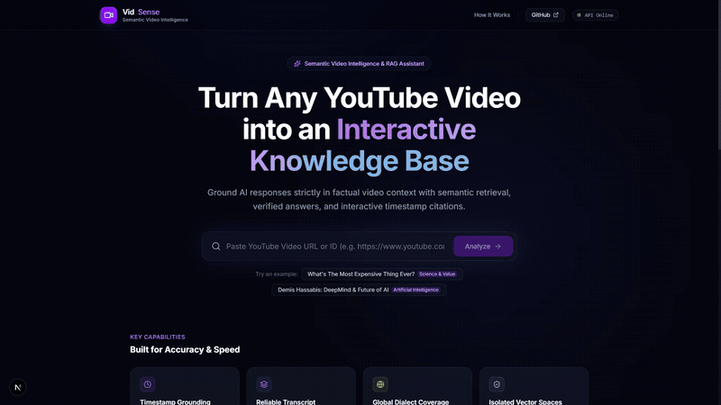

# 📺 VidSense: Semantic Video Intelligence & RAG Assistant

> **Full-stack, containerized AI video intelligence engine turning any YouTube video into an interactive, timestamp-grounded knowledge base with Next.js App Router, FastAPI, and FAISS.**


---

## 🌐 Live Website

[](https://yt-rag-bot-semantic-video-intelligencefinal-bdsb8pfg2.vercel.app/)

---

## 🎬 Product Demo

<div align="center">
  
  <p>
    <em>
      End-to-end walkthrough showing automated transcript ingestion, isolated FAISS vector indexing, 
      real-time streaming conversational Q&amp;A, and interactive timestamp citations that seek the video player to exact moments.
    </em>
  </p>
</div>

---

## 🎯 Why VidSense (Problem Statement)
- **Long-form Video Inefficiency**: Locating specific insights inside 1–3 hour lectures, podcasts, or technical keynotes requires tedious manual scrubbing.
- **Scraper Fragility**: Standard transcript scraping frequently breaks due to client signature challenges and cloud IP restrictions.
- **LLM Hallucinations**: Generic LLMs invent facts when asked about long-form video details without context grounding.

---

## 💡 Solution Overview
**VidSense** connects an automated, multi-tier ingestion pipeline (`yt-dlp` mobile-first endpoints with JS runtime + direct timedtext scrapers) to an isolated FAISS vector search layer and an OpenAI LLM. AI answers reference verified video timestamps; clicking any citation `[▶ MM:SS]` seeks the embedded video player to that exact moment.

---

## 🚀 Key Features

- 🖥️ **3-Pane Next.js AI Workspace**: Synchronized layout featuring an Embedded Video Player, Streaming AI Chat, and Retrieved Knowledge.
- 🎬 **Clickable Video Citations**: Clicking any `[▶ MM:SS]` badge in the chat, sources, or transcript automatically commands the YouTube player to jump and play.
- ⚡ **Real-Time Token Streaming (SSE)**: Powered by FastAPI `StreamingResponse` and LangChain `chain.stream()` for fast, responsive answers.
- 🌐 **Global Multi-Dialect Subtitle Support**: Deep language compatibility across international English tracks (`en`, `en-orig`, `en-US`, `en-GB`, `en-IN`, `en-CA`, etc.) and Hindi.
- 🛡️ **Intelligent Error Diagnosis**: Real-time diagnostic alerts distinguishing backend connectivity from disabled/unsupported video subtitles.
- 📄 **Full Searchable Transcript Modal**: Filter and read through every spoken line of the video with instant playback jumping.
- 🗄️ **Indexed Video Library Drawer**: Switch between previously ingested video knowledge bases on disk with 1 click.
- 🐳 **Full Dockerization**: One-command deployment with Docker and Docker Compose with persistent volume mounts.

---

## 🏗 System Architecture


---

## 🛠 Tech Stack

| Layer | Technology | Purpose |
| :--- | :--- | :--- |
| **Frontend** | [Next.js 16 (App Router)](https://nextjs.org/) + [TypeScript](https://www.typescriptlang.org/) | Modern 3-pane research workspace with responsive UI |
| **Styling** | [Tailwind CSS](https://tailwindcss.com/) + [Lucide Icons](https://lucide.dev/) | Dark glassmorphism, glowing accents, and micro-interactions |
| **Backend API** | [FastAPI](https://fastapi.tiangolo.com/) + [Uvicorn](https://www.uvicorn.org/) | Asynchronous REST & SSE streaming server |
| **Orchestration** | [LangChain](https://www.langchain.com/) (LCEL) | Declarative RAG chaining and prompt templates |
| **LLM & Embeddings** | [OpenAI API](https://openai.com/) | `gpt-4o-mini` & `text-embedding-3-small` (1536 dims) |
| **Vector DB** | [FAISS](https://github.com/facebookresearch/faiss) | In-memory similarity search with local disk serialization |
| **Ingestion** | `yt-dlp` + Node.js JS Runtime + Fallbacks | Multi-tier automated subtitle extraction |
| **Container** | [Docker](https://www.docker.com/) + Docker Compose | Containerized reproducible execution |

---

## 📈 Engineering Highlights

- ⚡ **Low-Latency Streaming**: Progressive token streaming via Server-Sent Events (SSE) reduces perceived response latency.
- 🌐 **Multi-Dialect Compatibility**: Automatic subtitle resolution across regional English variants and Hindi tracks.
- 🔍 **Strict Context Grounding**: Responses are bounded to retrieved transcript chunks with clickable timestamp references.
- 💰 **Local Vector Caching**: Vector indices are serialized to disk by video ID, avoiding redundant re-embedding compute for repeat queries.
- 🔌 **Decoupled Architecture**: Clean separation between the Next.js UI, FastAPI API layer, and FAISS vector index store.

---

## 💬 Verified Example Q&A Output

**Video**: *[What's The Most Expensive Thing Ever? (jXwOcpkMQAA)](https://www.youtube.com/watch?v=jXwOcpkMQAA)*

```text
OVERVIEW:
Antimatter is discussed as the most expensive substance in existence.

CORE WORKFLOW / KEY CONCEPTS:
- A single gram of antimatter releases energy equivalent to three Hiroshima nuclear bombs upon annihilation.
- Production requires particle acceleration by firing particles at high speeds into a metal rod and capturing resulting debris.

TECHNICAL HIGHLIGHTS:
- Antimatter production requires extreme vacuum conditions and particle acceleration techniques.
- CERN has generated less than 10 billionths of a gram throughout its entire operational history.

TIMESTAMPS:
- [07:37] Introduction to antimatter and energy potential.
- [07:51] Antimatter annihilation energy comparison.
- [08:10] Antimatter production mechanics and particle acceleration challenges.
```

---

## ⚡ How to Run

### 1. Configure Environment
```bash
git clone https://github.com/SwayamAg/YT-RAG-Bot-Semantic-Video-Intelligence.git
cd YT-RAG-Bot-Semantic-Video-Intelligence
cp .env.example .env
```

Add your API keys to `.env`:
```env
OPENAI_API_KEY=sk-...
OPENAI_MODEL=gpt-4o-mini
OPENAI_EMBEDDING_MODEL=text-embedding-3-small

# Optional: Google Cloud YouTube Data API v3 Key
YOUTUBE_API_KEY=AIzaSy...
```

---

### 2. Start the Backend (FastAPI)

```powershell
# Windows
.\.venv\Scripts\activate
uvicorn app.main:app --reload --port 8000

# Linux / Mac
source .venv/bin/activate
uvicorn app.main:app --reload --port 8000
```
- Swagger API Docs: **`http://localhost:8000/docs`**
- Healthcheck: **`http://localhost:8000/health`**

---

### 3. Start the Frontend (Next.js)

```bash
cd frontend
npm install
npm run dev
```
Open **`http://localhost:3000`** in your browser!

---

### 4. Or Run via Docker Compose
```bash
docker compose up --build
```

---

## 🌐 REST API Reference

| Method | Endpoint | Description |
| :--- | :--- | :--- |
| `GET` | `/health` | Service health and active model configuration status |
| `POST` | `/api/v1/video/info` | Inspect video ID, title, and disk cache status |
| `POST` | `/api/v1/ingest` | Ingest and vectorize a video transcript into FAISS |
| `POST` | `/api/v1/chat` | Primary RAG Q&A generating timestamp-grounded answers |
| `POST` | `/api/v1/chat/stream` | **Real-time SSE token stream** for low-latency chat |
| `POST` | `/api/v1/search` | Raw semantic similarity search returning top-K chunks |
| `GET` | `/api/v1/video/{video_id}/transcript` | Get full timestamped transcript segments |
| `GET` | `/api/v1/indexes` | List all persisted video vector indices on disk |
| `DELETE` | `/api/v1/indexes/{video_id}` | Purge a cached vector index from disk |

---

## 🔮 Future Scope & Evolution Roadmap

> 📖 **Full Architectural Ideation**: For the complete technical ideation, UI design wireframes, RAG evaluation methodology, and multi-video research roadmap, see the [Full-Stack Ideation Document](./Ideation.md).

### 🎯 V2 — Retrieval Quality & Intelligence (In Progress)
- **🔀 Hybrid Search + Late-Interaction Reranking (`Dense + BM25 + FlashRank`)**
  - *Why*: Dense vector search can overlook exact technical identifiers (e.g., model weights, specific code flags, numbers).
  - *Implementation*: Run dense FAISS embeddings alongside sparse BM25, combine candidate pools with Reciprocal Rank Fusion (RRF), and score top-20 with a FlashRank cross-encoder.
- **📊 Quantitative RAG Evaluation (Ragas Framework)**
  - *Why*: Systematically track Faithfulness, Answer Relevance, Context Precision, and Recall@K across chunk size variations (500 vs. 1000) and prompt adjustments instead of subjective testing.
- **📑 Automated Chapter & Timeline Detection**
  - *Why*: Provide an auto-generated structural outline of long lectures, allowing users to skim topics before querying.
  - *Implementation*: LLM-driven transcript segmentation clustering timestamps into thematic topic milestones.

### 🔬 V2.5 — Experimental Multimodal Video Analysis Layer
- **Visual Video Intelligence (Optional Add-on)**
  - *Concept*: An optional enrichment layer running alongside the core FAISS transcript pipeline.
  - *Why*: Enables answering questions beyond audio transcripts, such as *"What architecture diagram is shown on screen at 12:32?"* or *"What error was shown in the terminal?"*.

### 🚀 V3 — Multi-Modal & Large-Scale Expansion
- **🎬 Native Keyframe Vector Search (ColPali / CLIP)**: Direct local embedding of video keyframes for visual similarity.
- **🎙️ Speaker Diarization (`whisperx` / `pyannote.audio`)**: Attribution of statements to specific speakers (`[Host]` vs. `[Guest]`).
- **⚡ Distributed Vector Scaling**: Integration with managed cloud vector databases for large-scale video archives.
- **📚 Multi-Video Workspace Research**: Query across playlist archives or related lectures simultaneously with cross-video synthesis.

---

## 👨‍💻 Author

- **Name**: Swayam Agarwal  
- **LinkedIn**: [linkedin.com/in/swayam-agarwal](https://www.linkedin.com/in/swayam-agarwal/)  
- **GitHub**: [github.com/SwayamAg](https://github.com/SwayamAg)  
- **Email**: swayamagarwal19@gmail.com


